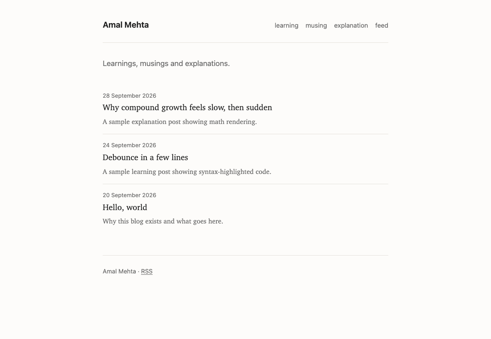

# Personal Blog

| Math, rendered at build time | Code, in dark mode |
| --- | --- |
|  |  |

A clean, simple static blog about history, art and architecture. You write posts in Markdown and [Eleventy](https://www.11ty.dev/) turns them into plain HTML, with code highlighting, KaTeX math, tags, an Atom feed and automatic dark mode.

Live at **https://amalmehta.github.io/personal-blog/**.

Setup, writing posts and publishing are covered in the **[Guide](docs/GUIDE.md)**.
